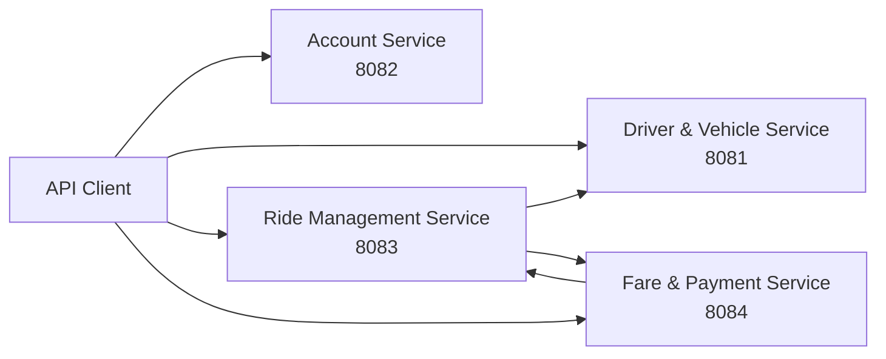

# IT3130-RideLink

**IT3130-RideLink** is a Spring Boot backend system for a ride-hailing platform. The system is developed using four independent microservices. Each microservice is responsible for a specific business function and maintains its own data persistence.

## Services

| Service | Port | Responsibility |
|---|---:|---|
| **Driver & Vehicle** | 8081 | Driver management, availability, vehicles, and driver-vehicle assignments |
| **Account** | 8082 | Account registration, authentication, and JWT issuing |
| **Ride Management** | 8083 | Ride creation, driver assignment, ride lifecycle, and fare integration |
| **Fare & Payment** | 8084 | Fare calculation, payments, and receipts |

The services communicate with each other through REST APIs.

There is **no frontend application** in this repository. The backend services can be demonstrated using **Swagger UI and Postman**.

## System Architecture



## Technology Stack

- **Java**
- **Spring Boot**
- **Spring Web**
- **Spring Data JPA**
- **Spring Security**
- **Bean Validation**
- **Maven**
- **MySQL (normal runtime), H2 (isolated tests / optional demo)**
- **Swagger / OpenAPI**
- **Git & GitHub**

Each microservice has its own data persistence and service boundary.

## Prerequisites

Before running the project, install:

- JDK 21
- Maven 3.6.3 or later
- Docker Desktop for the provided MySQL setup
- Python 3 for the local startup scripts

All four services use separate MySQL databases and database users. See [Local MySQL and Postman guide](docs/LOCAL-MYSQL-POSTMAN.md) for the tested setup. H2 is retained only for tests and the explicit Ride/Fare `h2` profile.

## Local startup and Postman

From the repository root, with Docker Desktop running:

```sh
python3 scripts/local.py start
python3 scripts/prepare-postman.py
```

Import `postman/RideLink-Full-Flow.postman_collection.json` and the generated `.local/RideLink-Local.postman_environment.json` into Postman. Select the environment and run the collection in order. See [the guide](docs/LOCAL-MYSQL-POSTMAN.md) for saved-data checks and manual service startup.

## Build and Test

Each microservice is a separate Maven project.

### Driver & Vehicle

From the repository root:

```powershell
.\mvnw.cmd clean test
```

### Account Service

```powershell
cd account-service
.\mvnw.cmd clean verify
```

### Ride Management Service

```powershell
cd ride-management-service
.\mvnw.cmd clean verify
```

### Fare & Payment Service

```powershell
cd fare-payment-service
.\mvnw.cmd clean verify
```

## Running the Services

Run each service in a separate terminal.

### 1. Account Service

```powershell
cd account-service
.\mvnw.cmd spring-boot:run
```

Runs on:

```text
http://localhost:8082
```

### 2. Driver & Vehicle Service

From the repository root:

```powershell
.\mvnw.cmd spring-boot:run
```

Runs on:

```text
http://localhost:8081
```

### 3. Ride Management Service

```powershell
cd ride-management-service
.\mvnw.cmd spring-boot:run
```

Runs on:

```text
http://localhost:8083
```

### 4. Fare & Payment Service

```powershell
cd fare-payment-service
.\mvnw.cmd spring-boot:run
```

Runs on:

```text
http://localhost:8084
```

For local/demo execution, configure the required database and environment variables before starting each service.

**Do not commit passwords, JWT secrets, or database credentials to the repository.**

## API Documentation

| Service | Port | Swagger UI | OpenAPI |
|---|---:|---|---|
| Driver & Vehicle | 8081 | `/swagger-ui/index.html` | `/v3/api-docs` |
| Account | 8082 | `/swagger-ui/index.html` | `/v3/api-docs` |
| Ride Management | 8083 | `/swagger-ui.html` | `/v3/api-docs` |
| Fare & Payment | 8084 | `/swagger-ui.html` | `/v3/api-docs` |

Swagger UI can be used to view and test the available REST APIs.

Postman can also be used for API testing.

## Service Communication

The microservices communicate through REST APIs.

The main communication flow is:

- **Ride Management → Driver & Vehicle** for available driver information.
- **Ride Management → Fare & Payment** for fare-related operations.
- **Fare & Payment → Ride Management** for completed ride information.
- **Account Service** provides authentication and JWT tokens for secured operations.

Each service maintains its own data and does not directly access another microservice's database.

## Repository Structure

```text
IT3130-RideLink/
├── pom.xml                 # Driver & Vehicle Maven project
├── src/                    # Driver & Vehicle source
├── account-service/
├── ride-management-service/
└── fare-payment-service/
```

## Development

Each service is developed and maintained independently using Git and GitHub feature branches.

The project follows a microservice architecture where each service has its own responsibility, application configuration, and data persistence.

## Team Project

**Module:** IT3130 – Application Development  
**Project:** RideLink  
**Architecture:** Microservices  
**Backend:** Java + Spring Boot

## Fare & Payment Service (Member 4)

The Fare & Payment backend lives in [`fare-payment-service/`](fare-payment-service/README.md). It includes fare estimates, final fare calculation, simulated payments, payment status and receipts.

See the service README for setup, Swagger, Postman examples, tests and the proposed integration contracts.
