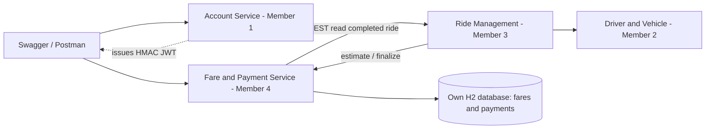

# Fare & Payment design notes

## Boundary and architecture



Only the Fare & Payment box and its database are implemented here. References to other services describe integration boundaries, not implemented dependencies. The service stores final fare snapshots and payment attempts. A receipt is derived from a successful payment and its immutable fare snapshot, with its receipt number/time persisted transactionally. There are no cross-service foreign keys or SQL queries.

The controller handles HTTP contracts; validation and DTOs define allowed inputs; application services handle business rules and transactions; repositories handle persistence; `FareCalculator` owns the pricing rule; `RideClient` is a dependency-inversion boundary with REST and demo implementations. Spring Security verifies identities and roles; `AccessControl` checks record ownership. External entities are never bound directly from request JSON.

A service split allows independent ownership, release and scaling of pricing/payment logic and protects its data boundary. For this small assignment a monolith would be simpler to deploy, debug and transact across ride completion/payment. Microservices add network failures, duplicated snapshots and token/contract coordination. The selected split follows the assignment's four business boundaries while keeping the local service small.

## Completion sequence

```mermaid
sequenceDiagram
    actor P as Passenger
    participant R as Ride Management
    participant F as Fare and Payment
    participant DB as Fare database
    R->>R: Commit COMPLETED + actual metrics
    R->>F: PUT /api/fares/rides/{id} (SERVICE JWT)
    F->>R: GET /api/rides/{id} (forward JWT)
    R-->>F: Completed ride + owner + actual metrics
    F->>F: Validate and calculate fixed rule
    F->>DB: Save immutable fare (unique ride ID)
    F-->>R: 200 final fare
    P->>F: POST payment (JWT + UUID key)
    F->>DB: Lock fare; check prior attempts
    alt New successful simulation
      F->>DB: Save SUCCEEDED + receipt number
      F-->>P: 200 SUCCEEDED
      P->>F: GET receipt
      F-->>P: JSON receipt
    else Simulated decline
      F->>DB: Save FAILED
      F-->>P: 200 FAILED; retry with new key
    else Duplicate same request
      F-->>P: Original attempt
    end
```

Synchronous REST is suitable for immediate estimates and finalization because callers need a definite price and validation result. JSON/OpenAPI is straightforward to demonstrate and debug across student-owned services. A queue could decouple completion and payment notifications and absorb temporary outages, but it introduces eventual consistency, broker setup, event versioning and deduplication. gRPC offers typed contracts and efficient transport but adds code generation and less direct Swagger/Postman use. The current scoped service uses REST with bounded timeouts; an outage returns an explicit error and does not invent trip data.

Idempotency keys identify payment intent per ride. Replaying one returns the existing result; using it with a changed method/outcome is a conflict. A pessimistic fare-row lock prevents concurrent successful attempts, and a unique `(fare_id, idempotency_key)` constraint protects request identity. The lock covers the short local simulation transaction; no external gateway request is made while holding it. Real payment processing would need gateway-side idempotency and a reconciliation workflow, which are outside this assignment.

## Verification and limits

Tests cover documented fare boundaries; invalid trip data and states; complete API workflows; failed attempts/retries; duplicate rejection; ownership on fares/payments/receipts; parallel payment requests; outbound bearer propagation and dependency failures; Account-format JWT signature, expiry, identity and role verification; and OpenAPI generation. H2 persistence uses Flyway migrations with schema validation.

No real maps, passenger data, payment provider, refunds or distributed transaction is involved. Fixed rates, a shared HMAC JWT contract, integer duration and the proposed Ride response are documented assumptions to agree with the group. Git history, remote CI and integration with the other three services must be completed in the actual shared repository.

References used for configuration: [Spring Security JWT resource server](https://docs.spring.io/spring-security/reference/6.5/servlet/oauth2/resource-server/jwt.html), [springdoc compatibility](https://springdoc.org/v2/), and the supplied RideLink assignment brief.
