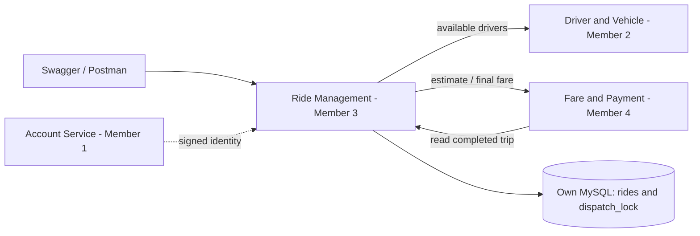

# Design, data ownership and explanation



Ride Management owns the lifecycle, trip metrics, assignment snapshot and local active reservations. It references account/driver/vehicle/fare IDs; none is a foreign key into another service's database. `rides` is the business table. `dispatch_lock` has one row used to serialize assignment decisions; it contains no Driver service data. Flyway also owns a migration-history table.

```mermaid
sequenceDiagram
    actor P as Passenger
    participant R as Ride Management
    participant F as Fare service
    participant D as Driver service
    actor DR as Driver
    actor A as Admin
    P->>R: POST ride
    R->>F: POST estimate
    F-->>R: Fare quote
    R->>R: Save REQUESTED
    P->>R: PUT assignment
    R->>D: GET available drivers
    R->>R: Lock dispatch; choose and reserve driver
    R-->>P: ASSIGNED
    DR->>R: PUT acceptance
    DR->>R: PUT start
    DR->>R: PUT completion + actual metrics
    R->>R: Commit COMPLETED and release reservation
    A->>R: PUT fare
    R->>F: PUT final fare (outside Ride transaction)
    F->>R: GET completed ride
    R-->>F: Committed actual metrics
    F-->>R: Final fare snapshot
    R->>R: Store fare reference
```

## Why these concepts

- Layered structure: controller translates HTTP requests; service orchestrates business rules; repository owns persistence operations; entities represent stored rides; DTOs are API data carriers.
- Constructor injection and interfaces: `DriverClient` / `FareClient` allow real REST and isolated demo implementations without changing lifecycle logic.
- State machine: `RideStatePolicy` constrains transitions. `RideService` combines those checks with ownership and row locks before mutating the entity.
- Encapsulation: entity fields are private; lifecycle methods express named operations instead of exposing arbitrary status setters.
- Validation: Bean Validation checks request bounds; upstream fare validation protects stored values; Jackson rejects unknown request fields and fractional integer fields.
- Transactions: lifecycle writes are atomic; Database constraints and locks prevent duplicate active reservations. Fare synchronization occurs outside the completion transaction to allow callback reads and independent retries.
- Security: Spring Security validates signed identities and roles, then `AccessControl` verifies record ownership and assigned-driver email.
- BigDecimal / UUID / Instant: decimal money and metrics, stable independent ride IDs, UTC timestamps.
- Flyway / JPA: versioned schema creation plus entity mapping and schema validation; no Hibernate auto-recreation of tables on startup.

Microservices permit separate student ownership, release and data boundaries. For this small system a monolith would simplify deployment, identity consistency and transactions. The service split introduces network failures, contract coordination and eventual consistency between completion and final fare, so explicit failure responses and retry rules are necessary.

Synchronous REST is used because an estimate and assignment need an immediate result and JSON/OpenAPI is easy to demonstrate. Queues could decouple completion and billing but require event versioning, broker setup, delivery retries and deduplication. gRPC offers typed efficient calls but adds code generation and tooling. No queue or gRPC implementation is claimed here.

## Class reading order

| Class / group | Responsibility |
|---|---|
| RideManagementApplication | Starts Spring Boot |
| RideStatus, RideStatePolicy | Allowed states/transitions |
| RideRequest, CompleteRideRequest, CancelRideRequest | Validated request records |
| RideResponse, RidePage | Authorized ride output |
| DriverResponse | Current Driver branch response subset |
| FareEstimateRequest, FareEstimateResponse, FareQuote, FinalFareResponse | Member 4 REST contracts |
| ApiError | Consistent error JSON |
| Ride | Persistent trip + named lifecycle changes |
| DispatchLock | Assignment serialization record |
| RideRepository, DispatchLockRepository | Queries, row locks and pagination |
| DriverSelector | Deterministic eligible-driver filtering |
| FareValidator | Rejects malformed upstream prices |
| RideService | Business workflow + local transactions |
| FareIntegrationService | Final-fare call and callback-safe retry orchestration |
| RideController | REST routes and role checks |
| DriverClient / FareClient | External dependency interfaces |
| RestDriverClient / RestFareClient / IntegrationHttp | HTTP adapters, token propagation, bounded timeouts |
| DemoDriverClient / DemoFareClient | Explicit standalone fixtures only |
| AccessControl | Owner / assigned driver / privileged checks |
| SecurityConfig | Demo Basic and live JWT security |
| OpenApiConfig | Swagger documentation and authorization scheme |
| ServiceException / GlobalExceptionHandler | Business failures → HTTP errors |

## Current limits

Local reservations coordinate one shared Ride database, not arbitrary independent dispatchers. Normal runtime uses MySQL with its own database and user. H2 remains an explicit option for isolated demonstrations. There is no refund, ride deletion, real map, notification, driver tracking stream or payment implementation. Actual metrics are simulated inputs from the authorized driver. Completion timestamps and metrics cannot be rewritten through the API. Creation has no idempotency key and each POST represents a new ride.
